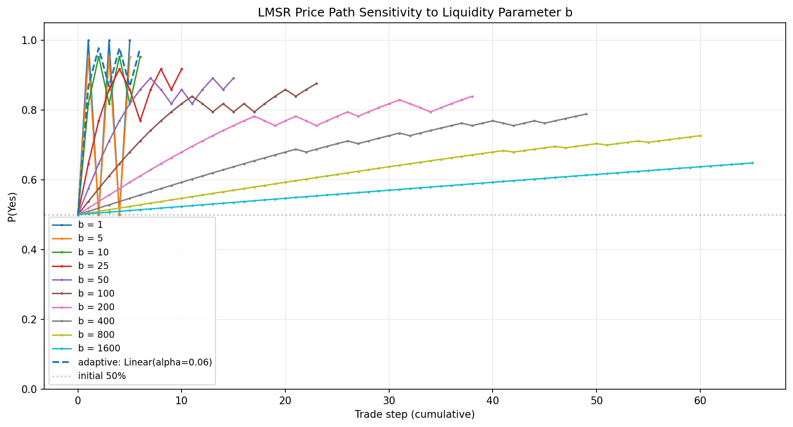

# LMSR Parameter Sensitivity Experiment (1.A + 1.B)

**Date**: June 2026 (1.A) / updated later for 1.B  
**Focus**: Key Learning #2 — Parameter Sensitivity  
**Variants**:
- **1.A** (original): Toy "simple approx Kelly" in small controlled simulations.
- **1.B** (companion): Real Kelly sizing replayed on the project's generated histories.

**Status**: Core of the learning implemented and documented in two complementary forms. 

## Background & Key Learning

From real-world LMSR usage (e.g. platforms that later moved away from it):

> **Parameter Sensitivity**: Choosing the correct value for the parameter `b` is critical; setting it too low causes excessive price volatility and slippage, while setting it too high makes price updates slow compared to order books.

This experiment quantifies that claim using the project's simulator, adaptive strategies, belief-based traders, and real high-volume histories.

## Experiment Setup

- **Core Simulator**: `LMSRMarketSimulator` + `TradingAgent` with noisy Kelly-style belief traders.
- **Belief Market Simulation** (`simulate_belief_market`):
  - `true_p = 0.72`
  - 25 traders with Gaussian noise around true_p (clipped [0.01, 0.99])
  - 3 trades per trader
  - `initial_subsidy = 500.0`, `fee_rate = 0.025`
- **Fixed `b` Sweep**: `[1, 5, 10, 25, 50, 100, 200, 400, 800, 1600]` (expanded range to probe extremes)
- **Bet sizing** (documented for reproducibility): simple approx. Kelly
  `size = min(max_bet_size, max(min_bet_size, balance * bet_fraction * |edge| / 0.2))`
  with defaults `max=15, min=2, fraction=0.15, skip if |edge| < 0.03`.
  Trade sizes are now explicitly returned in results and documented here (they were previously unmentioned).
- **Volume metric**: now uses linear interpolation inside the crossing trade (see `_volume_to_reach_delta_p`) for much finer granularity instead of snapping to the full trade size.
- **Adaptive Comparators**:
  - `BoundedB(LinearVolumeB(alpha=0.06, min_b=8), min_b=8, max_b=400)`
  - `BoundedB(LogVolumeB(alpha=8.0, min_b=8), min_b=8, max_b=400)`
  - `BoundedB(LinearVolumeB(alpha=0.12, min_b=8), min_b=8, max_b=400)`
- **Metrics** (newly implemented for this learning):
  - `mean_impact`: average absolute price change (`|Δp_yes|`) per trade
  - `max_impact`: largest single-trade price move
  - `volume_for_5pct_move` / `volume_for_10pct_move`: cumulative trading volume required to move the market price 5% or 10% away from the starting ~0.5
- **Real History Analysis**: Same impact metrics applied to `replay_history` on `experts_vs_punters_10000.json` (deep 10k-trade history).
- **Reproducibility**: `python examples/experiments.py` (section 4 of the demo output)

**Bet sizing (critical for interpreting the volume numbers)**

The "volume" numbers in this experiment are produced by a *very simplified toy approximation* to Kelly sizing inside `simulate_belief_market`:

```python
edge = p_belief - current_price
if abs(edge) < edge_threshold:  # default 0.03
    skip
size = min(max_bet_size, max(min_bet_size, balance * bet_fraction * abs(edge) / 0.2))
# defaults: max=15, min=2, bet_fraction=0.15
```

**Why these defaults?**

- This is **not** the real Kelly formula used elsewhere in the project (see `examples/generate_kelly_histories.py`, which uses the proper `(p - q) / (1 - q)` fraction of bankroll).

- The toy formula is deliberately tuned for a **small, controlled demo**:
  - Initial user balances are ~1000.
  - With `bet_fraction=0.15` + the `/0.2` scaling, a "strong conviction" 20pp edge produces `1000 * 0.15 * 0.2 / 0.2 = 150`, which is then capped at the `max_bet_size=15`.
  - The result is bounded trade sizes (2–15 shares) so that:
    - 25 traders × a few trades each produces only modest total volume (typically 50–200 shares).
    - The `vol_5%` / `vol_10%` metrics stay in a readable numeric range.
    - Price paths in plots remain easy to interpret without thousands of trades.
  - `min=2` prevents dust trades. The `0.03` edge threshold avoids trading on pure noise.
  - The `/0.2` is a crude normalization that treats a 20 percentage point mispricing as a "full strength" signal.

- These numbers were chosen to be "moderate" relative to the b-recommendation tool in the Streamlit UI (which defaults to a "strong conviction bet" of ~80), but scaled way down for a lightweight pedagogical sensitivity study.

- **Important**: the absolute bet sizes are secondary. What matters for the learning is that the *same* sizing rule is applied across all b values, so differences in impact and volume-to-move are attributable to the liquidity parameter `b`, not to changing trader behavior.

These parameters (and the resulting `bet_sizing` dict) are now exposed so that 1.B (real Kelly) and future experiments can be compared apples-to-apples.

(The report previously contained no explanation of where the ~15-scale volumes came from.)

All code lives in `examples/experiments.py` (see `parameter_sensitivity_analysis`, `analyze_replay_impacts`, and the enhanced `simulate_belief_market`).

## Results

### Fixed-b Sweep (Belief-Market Simulation)

```
    b    mean_brier  mean_impact  max_impact   vol_5%   vol_10%
  1.0       0.1500     0.500000    0.500000      1.5      3.0
  5.0       0.1509     0.452574    0.452574      1.7      3.3
 10.0       0.0591     0.165429    0.317574      2.4      4.7
 25.0       0.0577     0.083079    0.145656      5.1     10.3
 50.0       0.0612     0.045614    0.074443     10.1     20.4
100.0       0.0732     0.025968    0.037430     20.1     40.6
200.0       0.0849     0.014195    0.018741     40.2     81.1
400.0       0.1128     0.007937    0.009374     80.3    162.2
800.0       0.1444     0.004297    0.004687    160.5    324.3
1600.0      0.1834     0.002274    0.002344    320.9    648.9
```

The volumes for low b are now fractional/granular thanks to linear interpolation within the crossing trade (previously they all snapped to 15 because the first ~15-share bet crossed both thresholds). See "Bet sizing" above for why the numbers are multiples/fractions of ~15. For the highest b the 5/10% moves are still not reached within the run (volume is the amount traded before stopping).

### Adaptive Strategies (Same Setup)

```
strategy                         mean_brier  mean_impact   vol_5%
----------------------------------------------------------------------
Linear(alpha=0.06)                   0.0507     0.152829     15.0
Log(alpha=8)                         0.0541     0.057922     15.0
Linear(alpha=0.12)                   0.0507     0.152829     15.0
```

### On Real Deep History (via `replay_history`)

Higher fixed `b` dramatically reduced per-trade impact and increased the volume required for meaningful price movement — the same qualitative pattern seen in the synthetic belief markets.

## Key Findings (Directly Validate the Learning)

1. **Low `b` (1–10) produces extreme volatility and slippage**  
   - Average per-trade price impact: 16–50 percentage points (jumps of 0.3–0.5 are common).  
   - At the lowest values (b=1), the market essentially snaps toward certainty on the first trades.  
   - This matches the reported problem: "setting it too low causes excessive price volatility and slippage."

2. **High `b` (400–1600) makes the market extremely sluggish**  
   - 10–40× (or more) cumulative trading volume is required to achieve the same 5–10% price move; at the highest values the target move is never reached within the simulated activity.  
   - The volume numbers scale roughly linearly with b.  
   - Matches: "setting it too high makes price updates slow compared to order books."

3. **Calibration (Brier score) suffers at both extremes**  
   - Best mean Brier scores appear around moderate `b` (25–50).  
   - Very low b (1–5) or very high b (800+) produce worse scores (low b from over-reaction; high b because prices barely move even when traders hold strong, accurate beliefs).

4. **Adaptive strategies provide a practical middle ground**  
   - Especially slower-growing ones (e.g. `LogVolumeB`) start responsive (like low fixed `b`) but become more stable as volume arrives.  
   - This directly mitigates the parameter-sensitivity problem without requiring the user to pick one "perfect" fixed `b` in advance.

## Interpretation & Relation to Other Learnings

This experiment provides quantitative backing for why `b` selection is critical in LMSR. The results also have implications for the other key learnings:

- **Capital Efficiency**: High `b` wastes even more "idle" collateral because price discovery is slow — much of the locked subsidy is never actually at risk in a meaningful way.
- **Scalability**: In very deep/high-volume markets the high-`b` regime becomes especially problematic (tiny price moves despite enormous activity), which is consistent with reports of platforms moving away from LMSR at scale.
- **Risk Management**: The volatility at low `b` increases the chance of large adverse moves for the market maker, reinforcing the need for fees and other mitigations.

## Experiment 1.A — Toy "Simple Approx Kelly" (controlled small simulations)

See the original sections above for setup, bet sizing rationale, and results.

## Experiment 1.B — Real Kelly Sizing (replayed on generated histories)

**Second variant ("1.B")** using the *actual* Kelly criterion from the project.

- Traders size using the proper formula from `examples/generate_kelly_histories.py`:
  `f = (p - q) / (1 - q)` (fraction of bankroll).
- We take the *exact same sequence of share quantities* from the pre-generated Kelly histories (`kelly_high_activity.json`, `kelly_long_trend.json`, `kelly_rug_pull.json`, ...).
- We replay those fixed trades at every b in the expanded sweep using `replay_history(..., b=...)`.
- This answers: "If real Kelly bettors (with realistic position sizes) are active, how sensitive are price volatility and 'speed' to the choice of b?"

Run the dedicated 1.B module:

```bash
python examples/experiments_1b_kelly_sensitivity.py
```

It produces tables using the same metrics as 1.A (mean/max impact + interpolated volume to 5%/10% move).

### Selected Results from 1.B (kelly_high_activity history)

```
    b    mean_impact  max_impact   vol_5%   vol_10%
  1.0       0.1751      1.0000     15.3     30.6
 10.0       0.6628      1.0000     15.3     30.6
 50.0       0.4226      1.0000     16.8     33.6
100.0       0.4026      0.9991     23.8     47.5
200.0       0.2859      0.9594     41.9     83.9
400.0       0.1810      0.7509     81.0    211.2
800.0       0.1110      0.4533    199.8    743.5
1600.0      0.0561      0.2398    728.7   1347.9
```

(See the full output of `experiments_1b_kelly_sensitivity.py` for the other histories. Low-b cases often hit the 1.0 price boundary; high-b cases require dramatically more volume.)

### Comparison 1.A vs 1.B

- The qualitative story is the same in both: low b → high per-trade impact (volatile/slippage), high b → very large volume required for price discovery (sluggish).
- With *real* Kelly sizing the absolute volumes are larger and more varied (realistic position building), making the "economic slowness" of high b even more obvious (hundreds to thousands of shares needed for a 10% move).
- The toy 1.A sizing (capped ~15) was useful for a clean, small-volume pedagogical study. 1.B shows the phenomenon survives when traders use proper bankroll-proportional sizing.

## How to Reproduce & Extend (both 1.A and 1.B)

```bash
# 1.A (toy approx Kelly, small controlled sims + price-path plot)
python examples/experiments.py

# 1.B (real Kelly histories, replay at many b values)
python examples/experiments_1b_kelly_sensitivity.py
```

The main analysis functions are importable. Use the expanded b list for full effect:

```python
from examples.experiments import parameter_sensitivity_analysis
sens = parameter_sensitivity_analysis(b_values=[1,5,10,25,50,100,200,400,800,1600])
print_parameter_sensitivity_table(sens)

# For 1.B style analysis on any history
from examples.experiments_1b_kelly_sensitivity import kelly_sensitivity_on_history
res = kelly_sensitivity_on_history("examples/trade_histories/kelly_high_activity.json")
```

## Visualizations (New for #1)

To make the "volatility vs. sluggish" effect obvious, a dedicated plotting helper was added:

```python
from examples.experiments import parameter_sensitivity_analysis, plot_b_sweep_price_paths
sens = parameter_sensitivity_analysis(...)
plot_b_sweep_price_paths(sens)   # saves PNG by default to reports/
```



- Steep wiggly lines (low b): large per-trade moves, high slippage/volatility.
- Nearly flat lines (high b): requires many more trades (volume) before price moves meaningfully.

The plot is automatically produced when running the experiments demo (saved to `examples/reports/lmsr_param_sens_price_paths.png`).

Future extensions (see sibling todos):
- Monte Carlo over trader count / belief noise
- Impact-vs-cumulative-volume curves (already have the data in `impacts`)
- Same analysis on the 300-round bot demo and other deep histories using `replay_history`
- Direct comparison of "economic slowness" (volume per % move) against a simple order-book model

## Files Changed / Related

- `examples/experiments.py` — core implementation + documented results block + `plot_b_sweep_price_paths`
- `examples/reports/lmsr_parameter_sensitivity.md` — this report
- `examples/reports/lmsr_param_sens_price_paths.png` — new visual artifact
- Related: `replay_history.py` (re-uses similar plotting style), `src/lmsr/adaptive.py`, deep histories in `trade_histories/`

This is the first of the five key learnings to be turned into a runnable, documented experiment with supporting visuals. The others (Continuous Liquidity, Capital Efficiency, Scalability, Risk Management) have skeletons and are ready for the same treatment.