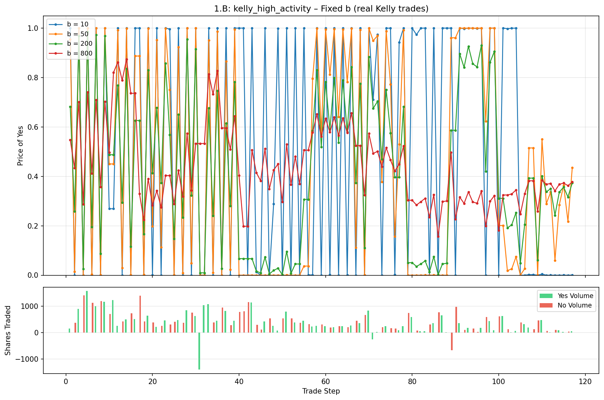
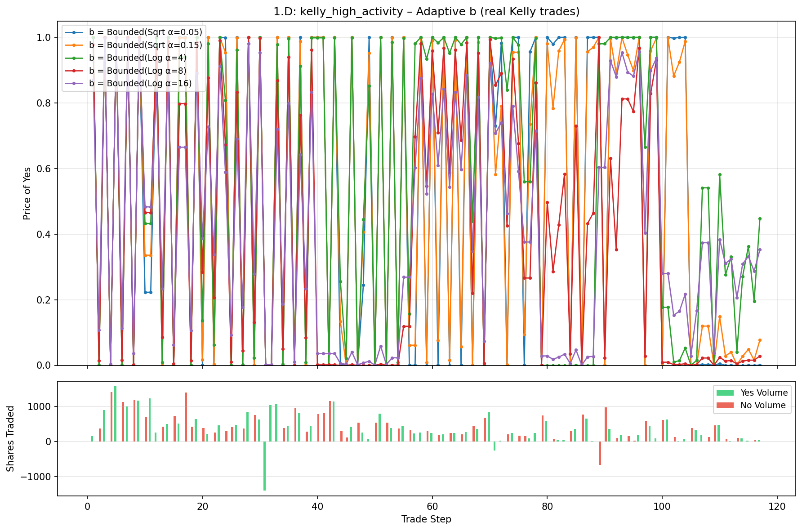

# LMSR Parameter Sensitivity Experiment

**Date**: June 2026 (initial) / restructured for clear 1.A–1.D separation  
**Focus**: Key Learning #2 — Parameter Sensitivity  
**The four clearly-marked variants** (all using the expanded b sweep `[1, 5, 10, 25, 50, 100, 200, 400, 800, 1600]`):

- **1.A.** Fixed b with approximate (toy) Kelly
- **1.B.** Fixed b with true Kelly (replayed on generated histories)
- **1.C.** Adaptive b with approximate (toy) Kelly
- **1.D.** Adaptive b with true Kelly

**Status**: All four variants implemented. Raw results live in their own sections. All discussion, findings, interpretation, and comparison are consolidated at the very end.

## Table of Contents

- [Background & Key Learning](#background--key-learning)
- [1.A. Fixed b with Approximate Kelly (toy simulations)](#1a-fixed-b-with-approximate-kelly-toy-simulations)
- [1.B. Fixed b with True Kelly (replayed on generated histories)](#1b-fixed-b-with-true-kelly-replayed-on-generated-histories)
- [1.C. Adaptive b with Approximate Kelly (toy simulations)](#1c-adaptive-b-with-approximate-kelly-toy-simulations)
- [1.D. Adaptive b with True Kelly (replayed on generated histories)](#1d-adaptive-b-with-true-kelly-replayed-on-generated-histories)
- [Discussion](#discussion-all-findings-interpretation-and-comparison--consolidated-at-the-end)

## Background & Key Learning

From real-world LMSR usage (e.g. platforms that later moved away from it):

> **Parameter Sensitivity**: Choosing the correct value for the parameter `b` is critical; setting it too low causes excessive price volatility and slippage, while setting it too high makes price updates slow compared to order books.

This experiment quantifies that claim using the project's simulator, adaptive strategies, belief-based traders, and real high-volume histories. The four variants isolate the effects of (a) fixed vs. adaptive b and (b) toy vs. true Kelly trader sizing.

---

## 1.A. Fixed b with Approximate Kelly (toy simulations)

**Setup specific to 1.A**

- Core simulator + `simulate_belief_market` with noisy beliefs around `true_p = 0.72`
- 25 traders, 3 trades each
- Toy "simple approx Kelly" sizing (see bet-sizing details below)
- Fixed b sweep only
- Same metrics as the overall study

**Bet sizing (toy approximation used in 1.A and 1.C)**

```python
size = min(max_bet_size, max(min_bet_size, balance * bet_fraction * abs(edge) / 0.2))
# defaults: max=15, min=2, bet_fraction=0.15, edge_threshold=0.03
```

(See the Discussion at the end for the full rationale of these defaults.)

**Volume metric**

Linear interpolation inside the crossing trade for granularity (see `_volume_to_reach_delta_p`).

**Results — 1.A Fixed b (Approximate Kelly)**

```
    b    mean_brier  mean_impact  max_impact   vol_5%   vol_10%
  1.0       0.1500     0.500000    0.500000      1.5      3.0
  5.0       0.1509     0.452574    0.452574      1.7      3.3
 10.0       0.0591     0.165429    0.317574      2.4      4.7
 25.0       0.0577     0.083079    0.145656      5.1     10.3
 50.0       0.0612     0.045614    0.074443     10.1     20.4
100.0       0.0732     0.025968    0.037430     20.1     40.6
200.0       0.0849     0.014195    0.018741     40.2     81.1
400.0       0.1128     0.007937    0.009374     80.3    162.2
800.0       0.1444     0.004297    0.004687    160.5    324.3
1600.0      0.1834     0.002274    0.002344    320.9    648.9
```

**Plot**: `lmsr_param_sens_fixed.png` (generated by `python examples/experiments.py`) — located in `parameter_sensitivity/` subdirectory.

---

## 1.B. Fixed b with True Kelly (replayed on generated histories)

**Setup specific to 1.B**

- Uses the pre-generated Kelly histories (`kelly_high_activity.json`, `kelly_long_trend.json`, `kelly_rug_pull.json`, ...)
- Traders used the *real* Kelly fraction `(p - q) / (1 - q)` when the histories were created (see `generate_kelly_histories.py`)
- We replay the *exact same sequence of share quantities* at different fixed b values using `replay_history(..., b=b)`
- Same impact / volume-to-move metrics
- Trader behavior (share sizes) is held constant; only the market's b changes

**Results — 1.B Fixed b (True Kelly)**

**kelly_high_activity**

```
    b    mean_impact  max_impact   vol_5%   vol_10%
  1.0       0.1751      1.0000     15.3     30.6
 10.0       0.6628      1.0000     15.3     30.6
 50.0       0.4226      1.0000     16.8     33.6
100.0       0.4026      0.9991     23.8     47.5
200.0       0.2859      0.9594     41.9     83.9
400.0       0.1810      0.7509     81.0    211.2
800.0       0.1110      0.4533    199.8    743.5
1600.0      0.0561      0.2398    728.7   1347.9
```

(Full results for the other two histories are produced by `python examples/experiments_1b_kelly_sensitivity.py`.)

**Proper Kelly price+volume plot (1.B fixed b on real Kelly trades)** – this is the standard price graph style used for Kelly histories in the project (P(Yes) on top, Yes/No volume bars per trade below):



These plots (and the ones for 1.D) are now automatically generated when you run `python examples/experiments_1b_kelly_sensitivity.py`.

---


## 1.C. Adaptive b with Approximate Kelly (toy simulations)

**Setup specific to 1.C**

- Same toy belief-market simulation and sizing as 1.A
- But now b is one of several adaptive strategies (instead of fixed)
- Expanded to 9 strategies for richer comparison:

  - Bounded(Linear α=0.03/0.06/0.12/0.25)
  - Bounded(Sqrt α=0.05/0.15)
  - Bounded(Log α=4/8/16)

**Results — 1.C Adaptive b (Approximate Kelly)**

```
strategy                         mean_brier  mean_impact     vol_5%
----------------------------------------------------------------------
Bounded(Linear α=0.03)               0.1509     0.452574        1.7
Bounded(Linear α=0.06)               0.0507     0.152829        2.0
Bounded(Linear α=0.12)               0.0507     0.152829        2.0
Bounded(Linear α=0.25)               0.0591     0.165429        2.4
Bounded(Sqrt α=0.05)                 0.0507     0.152829        2.0
Bounded(Sqrt α=0.15)                 0.0507     0.152829        2.0
Bounded(Log α=4)                     0.0862     0.151835        2.5
Bounded(Log α=8)                     0.0541     0.057922        4.6
Bounded(Log α=16)                    0.0584     0.027966        9.0
```

**Separate plot**: `lmsr_param_sens_adaptive.png` (dedicated adaptive-only view, generated alongside the fixed plot) — located in `parameter_sensitivity/` subdirectory.

---

## 1.D. Adaptive b with True Kelly (replayed on generated histories)

**Setup specific to 1.D**

- Same real Kelly-sized trade sequences as 1.B
- But the market now uses an adaptive b strategy during replay (via `replay_history(..., b=adaptive_strat)`)
- Demonstrates interaction between realistic trader position sizing and dynamic liquidity rules

**Results — 1.D Adaptive b (True Kelly)**

(Only the last 5 strategies are shown in 1.D tables and plots — low b / small alpha produce too noisy paths, similar to fixed low b. Full 9 strategies match 1.C; see `experiments_1b_kelly_sensitivity.py` output for exact numbers.)

Strategies plotted for 1.D (only last 5 shown in tables/plots for 1.D — low b/small alpha too noisy; computation uses full 9 matching 1.C exactly):

```
strategy                         mean_impact     vol_5%
----------------------------------------------------------------------
Bounded(Sqrt α=0.05)               0.663432       15.3
Bounded(Sqrt α=0.15)               0.666277       15.3
Bounded(Log α=4)                   0.490372       15.3
Bounded(Log α=8)                   0.430411       16.0
Bounded(Log α=16)                  0.322360       20.7
```

(From fresh run on `kelly_high_activity`; re-run script for other histories.)

**Proper Kelly price+volume plot (1.D adaptive b on real Kelly trades)**:



These are generated automatically by `python examples/experiments_1b_kelly_sensitivity.py` (same style as the 1.B plots and the project's other Kelly analyses).

---


## Discussion (all findings, interpretation, and comparison — consolidated at the end)

### Key Findings (Directly Validate the Learning)

1. **Low `b` (1–10) produces extreme volatility and slippage**  
   Average per-trade price impact 16–50+ pp in the toy case; often hits price boundaries quickly in real-Kelly replays.

2. **High `b` (400–1600) makes the market extremely sluggish**  
   Volume required for a 5–10% move scales roughly with b (or the move is never reached). Real-Kelly histories show even larger absolute volumes needed.

3. **Calibration (Brier) suffers at both extremes**  
   Moderate b (≈25–100) generally best. Very low b over-reacts; very high b barely moves even when traders have accurate beliefs.

4. **Adaptive strategies provide a practical middle ground**  
   Slower-growing rules (Log, low-alpha Linear/Sqrt) stay responsive early and stabilize later. Visible in both the toy (1.C) and real-Kelly (1.D) settings. The dedicated adaptive plot makes the differences easy to see.

### Interpretation & Relation to Other Learnings

(See the consolidated interpretation in the original report text — the qualitative story is consistent across all four variants.)

### How to Reproduce

```bash
# 1.A + 1.C (toy approx Kelly, fixed + adaptive, with two separate plots)
python examples/experiments.py

# 1.B + 1.D (true Kelly on real histories, fixed + adaptive)
# Running this also auto-generates the proper Kelly price+volume graphs below
python examples/experiments_1b_kelly_sensitivity.py
```

Use the expanded b list and the `bet_sizing` dict that is now returned.

The proper Kelly price+volume plots (the standard style used elsewhere in the project for Kelly histories) are now included directly in the 1.B and 1.D sections. These were added in response to feedback (the previous restructure had moved detailed visualization notes to the end to keep raw data per-section; the Kelly-specific ones are now embedded per-variant).

### Files Changed / Related

- `examples/experiments.py` — 1.A + 1.C (toy) with clear section markers and two plot helpers
- `examples/experiments_1b_kelly_sensitivity.py` — 1.B + 1.D (true Kelly) with clear 1.B/1.D sections
- `examples/reports/parameter_sensitivity/lmsr_parameter_sensitivity.md` — this report (restructured, all experiment 1 files now in this subdirectory)
- Generated plots in `examples/reports/parameter_sensitivity/` (the fixed, adaptive, 1.B Kelly fixed price+volume, and 1.D Kelly adaptive price+volume plots)
- Related: `replay_history.py`, `src/lmsr/adaptive.py`, `generate_kelly_histories.py`, `trade_histories/`

Future extensions remain the same (Monte Carlo, impact-vs-volume curves, order-book comparison, etc.).

This is the first of the five key learnings turned into a clean, four-variant, runnable, documented experiment. The others have skeletons ready for the same treatment.